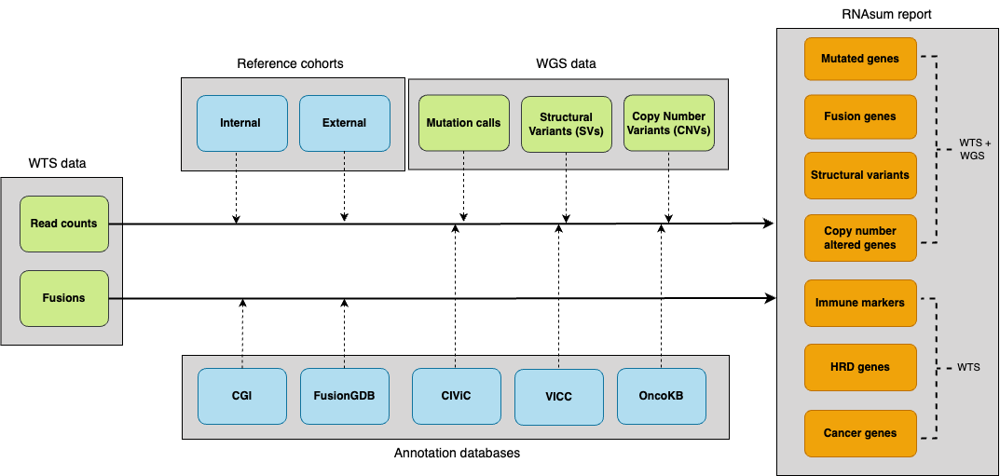

```{r setup, include=FALSE}
knitr::opts_chunk$set(echo = TRUE, eval = FALSE)
```

# RNAsum

Transforms RNA-sequencing data into actionable clinical insights with automated reports.

[](https://doi.org/10.5281/zenodo.17353511)
[](https://opensource.org/licenses/MIT)

**Documentation** | [umccr.github.io/RNAsum](https://umccr.github.io/RNAsum/)

## What is RNAsum?

`RNAsum` is an R package that integrates whole-genome sequencing (WGS) and whole-transcriptome sequencing (WTS) data to generate comprehensive, interactive HTML reports for cancer patient samples.

## Installation

### Mac

We recommend using Docker:

```bash
# Check https://github.com/umccr/RNAsum/releases for the latest release
VERSION=2.0.4
docker pull ghcr.io/umccr/rnasum:${VERSION}
docker run --rm ghcr.io/umccr/rnasum:${VERSION} rnasum.R --version
docker run --rm ghcr.io/umccr/rnasum:${VERSION} rnasum.R --help
```

Mount local data directories with `-v`:

```bash
docker run --rm \
  -v /path/to/inputs:/inputs \
  -v /path/to/outputs:/outputs \
  ghcr.io/umccr/rnasum:${VERSION} \
  rnasum.R --sample_name SAMPLE --dataset PANCAN \
           --salmon /inputs/quant.genes.sf \
           --report_dir /outputs
```

### HPC / Linux

Use the conda lock file for a pinned, reproducible install:

```bash
# Platforms: linux-64, linux-aarch64
# Check https://github.com/umccr/RNAsum/releases for the latest version
PLATFORM=linux-64
VERSION=2.0.4
LOCK_URL="https://raw.githubusercontent.com/umccr/RNAsum/refs/tags/v${VERSION}/deploy/conda/env/lock/rnasum-${PLATFORM}.lock"
conda create -n rnasum --file "${LOCK_URL}"
conda activate rnasum
rnasum.R --version
rnasum.R --help
```

## Workflow

The pipeline consists of five main components.



1. **WTS data collection**: ingests per-gene read counts and gene fusions.
2. **Reference integration**: normalises against [reference cohorts](https://umccr.github.io/RNAsum/articles/reference_cohorts.html).
3. **WGS data integration**: links genomic alterations with expression data.
4. **Knowledge enrichment**: annotates with clinically relevant databases.
5. **Report generation**: prioritises findings and creates interactive visualizations.

[Detailed workflow documentation](https://umccr.github.io/RNAsum/articles/workflow.html)

## Usage

```bash
rnasum.R --version
rnasum.R --help
```

### Batch effect considerations

When comparing clinical RNA-seq samples to TCGA reference cohorts, batch effects can significantly impact expression rankings due to protocol differences (e.g., ribo-depletion vs poly-A selection, different library preparation methods).

RNAsum provides the `--batch_rm` parameter to address these differences:

**When to use `--batch_rm`:**

- Clinical samples use different RNA-seq protocols than TCGA
- An internal reference cohort was processed with the same protocol
- Expression rankings appear systematically skewed

**Alternative approaches:**

- Use tissue-matched internal reference cohorts when available
- Consider protocol-specific thresholds for expression classification
- Validate findings with orthogonal methods when possible

### Common options

| Option | Description | Default |
|--------|-------------|---------|
| `--sample_name` | Sample identifier | Required |
| `--dataset` | TCGA reference cohort | `PANCAN` |
| `--batch_rm` | Remove batch effects | `TRUE` |
| `--salmon` | Salmon quantification file | - |
| `--kallisto` | Kallisto abundance file | - |
| `--arriba_tsv` | Arriba fusion detection output | - |
| `--pcgr_tiers_tsv` | PCGR variant calls (tier 1-4) | - |
| `--cn_gene_tsv` | Copy number by gene | - |
| `--filter` | Filter low-expressed genes | `TRUE` |

Run `rnasum.R --help` to get complete list of options.

For format and minimal content of input files (e.g. `--pcgr_tiers_tsv`, `--cn_gene_tsv`, `--sv_tsv`), see [Input file formats](https://umccr.github.io/RNAsum/articles/input_files.html).

**Note**: human reference genome [GRCh38](https://www.ncbi.nlm.nih.gov/assembly/GCF_000001405.39) (Ensembl based annotation version 105) is used for gene annotation by default. GRCh37 is no longer supported.

## Examples

**Test data**: bundled with the package in `inst/rawdata/test_data/`
**Runtime**: < 15 minutes (16GB RAM, 1 CPU)

```bash
# Locate bundled test data
TESTDATA=$(Rscript -e 'cat(system.file("rawdata/test_data", package="RNAsum"))')
```

### Scenario 1: WGS + WTS (recommended)

Comprehensive reporting, in which WGS-based findings are used as a primary source for expression profile prioritisation.

```bash
rnasum.R \
  --sample_name test_sample_WTS \
  --dataset TEST \
  --salmon "${TESTDATA}/dragen/TEST.quant.genes.sf" \
  --arriba_pdf "${TESTDATA}/dragen/arriba/fusions.pdf" \
  --arriba_tsv "${TESTDATA}/dragen/arriba/fusions.tsv" \
  --dragen_fusions "${TESTDATA}/dragen/test_sample_WTS.fusion_candidates.final" \
  --pcgr_tiers_tsv "${TESTDATA}/small_variants/TEST-snvs_indels.tiers.tsv" \
  --cn_gene_tsv "${TESTDATA}/copy_number/TEST.cnv.gene.tsv" \
  --sv_tsv "${TESTDATA}/structural/TEST-sv.tsv" \
  --report_dir /tmp/rnasum_test \
  --save_tables FALSE \
  --filter TRUE
```

The HTML report will be created in `/tmp/rnasum_test/`.

### Scenario 2: WTS only

Basic reporting including information about detected gene fusions and expression levels of key genes.

```bash
rnasum.R \
  --sample_name test_sample_WTS \
  --dataset TEST \
  --salmon "${TESTDATA}/dragen/TEST.quant.genes.sf" \
  --arriba_pdf "${TESTDATA}/dragen/arriba/fusions.pdf" \
  --arriba_tsv "${TESTDATA}/dragen/arriba/fusions.tsv" \
  --report_dir /tmp/rnasum_test \
  --save_tables FALSE \
  --filter TRUE
```

The HTML report will be created in `/tmp/rnasum_test/`.

## Batch effects assessment

Assess potential batch effects between the clinical sample and TCGA reference data before running the main analysis. This is particularly important when using different RNA-seq protocols.

### Basic setup

The batch assessment functions (`assess_batch_effects()`, `quick_batch_check()`) are available directly after `library(RNAsum)`.

### Quick start

```{r batch-quickstart, eval=FALSE}
library(RNAsum)

# Load test sample data (Salmon gene quantification)
test_file <- system.file("rawdata/test_data/dragen/TEST.quant.genes.sf", package = "RNAsum")
sample_data <- read.delim(test_file)
sample_tpm <- setNames(sample_data$TPM, sample_data$Name)

# Get reference data
ref_paths <- get_refdata(dataset = "TEST", batch_rm = FALSE)
ref_counts <- utils::read.table(gzfile(ref_paths$ext_ref$counts),
                                header = TRUE, sep = "\t", row.names = NULL)
ref_matrix <- as.matrix(ref_counts[, -1])
rownames(ref_matrix) <- ref_counts[[1]]

# Quick assessment using most variable genes (default)
batch_results <- assess_batch_effects(
  sample_data = sample_tpm,
  reference_data = ref_matrix,
  gene_set_type = "top_n",
  n_genes = 2000,
  output_dir = "batch_assessment_results"
)
```

**Assessment interpretation:**

- **PCA distance percentile > 95%**: High batch effect risk - consider `--batch_rm`
- **Median correlation < 0.7**: Substantial protocol differences detected
- **Extreme Z-scores > 10%**: Expression ranking issues likely

<details>
<summary><strong>Detailed gene set options and examples</strong></summary>

RNAsum provides **three gene set options** for targeted batch assessment.

**Option 1: Top variable genes (default)**

```{r batch-topn, eval=FALSE}
# Standard assessment using most variable genes (recommended for general use)
batch_results <- assess_batch_effects(
  sample_data = sample_tpm,
  reference_data = ref_matrix,
  gene_set_type = "top_n",          # Uses most variable genes
  n_genes = 2000,                   # Number of genes to analyze
  protocol_clinical = "ribo-depletion",
  protocol_reference = "TCGA_poly-A",
  output_dir = "batch_assessment_topn"
)
```

**Option 2: Cancer gene set**

```{r batch-cancer, eval=FALSE}
# Combined cancer genes database (1315 unique genes)
batch_cancer_combined <- assess_batch_effects(
  sample_data = sample_tpm,
  reference_data = ref_matrix,
  gene_set_type = "cancer_genes",
  cancer_gene_source = "combined",    # Combined UMCCR + OncoKB databases
  protocol_clinical = "ribo-depletion",
  protocol_reference = "TCGA_poly-A",
  output_dir = "batch_assessment_cancer_combined"
)

# Quick assessment with cancer genes
quick_batch_check(
  sample_data = sample_tpm,
  reference_data = ref_matrix,
  gene_set_type = "cancer_genes",
  cancer_gene_source = "combined",
  save_plots = TRUE
)
```

**Option 3: Custom gene set**

```{r batch-custom, eval=FALSE}
# User-defined gene sets (genes must match sample data format)
# Note: Ensure gene IDs match data format (Ensembl IDs vs gene symbols)

# Method 1: Direct Ensembl ID specification
custom_genes_direct <- c("ENSG00000141510", "ENSG00000012048", "ENSG00000139618")  # TP53, BRCA1, BRCA2

batch_custom_direct <- assess_batch_effects(
  sample_data = sample_tpm,
  reference_data = ref_matrix,
  gene_set_type = "custom",
  gene_subset = custom_genes_direct,
  protocol_clinical = "ribo-depletion",
  protocol_reference = "TCGA_poly-A",
  output_dir = "batch_assessment_custom_direct"
)

# Method 2: Use cancer genes with automatic conversion (recommended)
batch_cancer_symbols <- assess_batch_effects(
  sample_data = sample_tpm,
  reference_data = ref_matrix,
  gene_set_type = "cancer_genes",      # Enhanced: handles symbols automatically
  cancer_gene_source = "combined",     # 1315 genes with auto-conversion
  protocol_clinical = "ribo-depletion",
  protocol_reference = "TCGA_poly-A",
  output_dir = "batch_assessment_cancer_auto"
)
```

### Prerequisites for cancer gene sets (Option 2)

For cancer gene set analysis, use the enhanced built-in functionality with automatic format conversion:

- **No external files needed** - Cancer gene databases and format conversion are built-in
- **Automatic gene ID conversion** - Handles Ensembl IDs ↔ gene symbols transparently
- **Three cancer databases available** - UMCCR (1248), OncoKB (1019), Combined (1315 genes)
- **Smart format detection** - Automatically detects and converts incompatible formats

</details>

<details>
<summary><strong>Complete workflow example</strong></summary>

Running all three options with TEST data

```{r batch-workflow, eval=FALSE}
# Streamlined batch assessment workflow using enhanced functionality
library(RNAsum)

# Load test sample data
test_file <- system.file("rawdata/test_data/dragen/TEST.quant.genes.sf", package = "RNAsum")
sample_data <- read.delim(test_file)
sample_tpm <- setNames(sample_data$TPM, sample_data$Name)

# Get reference data
ref_paths <- get_refdata(dataset = "TEST", batch_rm = FALSE)
ref_counts <- utils::read.table(gzfile(ref_paths$ext_ref$counts),
                                header = TRUE, sep = "\t", row.names = NULL)
ref_matrix <- as.matrix(ref_counts[, -1])
rownames(ref_matrix) <- ref_counts[[1]]

# OPTION 1: Top variable genes
batch_topn <- assess_batch_effects(
  sample_data = sample_tpm,
  reference_data = ref_matrix,
  gene_set_type = "top_n",
  n_genes = 2000,
  protocol_clinical = "ribo-depletion",
  protocol_reference = "TCGA_poly-A"
)

# OPTION 2: Cancer genes
batch_cancer <- assess_batch_effects(
  sample_data = sample_tpm,
  reference_data = ref_matrix,
  gene_set_type = "cancer_genes",
  cancer_gene_source = "combined",
  protocol_clinical = "ribo-depletion",
  protocol_reference = "TCGA_poly-A"
)

# OPTION 3: Custom genes
custom_ensembl <- c("ENSG00000141510", "ENSG00000012048", "ENSG00000139618")  # TP53, BRCA1, BRCA2
batch_custom <- assess_batch_effects(
  sample_data = sample_tpm,
  reference_data = ref_matrix,
  gene_set_type = "custom",
  gene_subset = custom_ensembl,
  protocol_clinical = "ribo-depletion",
  protocol_reference = "TCGA_poly-A"
)

# Compare results
cat("=== Enhanced Batch Assessment Results ===\n")
cat("Top genes analysis: ", round(batch_topn$pca_results$distance_percentile * 100, 1), "% PCA distance percentile\n")
cat("Cancer genes analysis: ", round(batch_cancer$pca_results$distance_percentile * 100, 1), "% PCA distance percentile\n")
cat("Custom genes analysis: ", round(batch_custom$pca_results$distance_percentile * 100, 1), "% PCA distance percentile\n")
```


</details>

## What's in the report?

`RNAsum` generates an interactive HTML report with the following core sections:

- **Findings summary**: summary of genes listed across various report sections
- **Mutated genes**: expression of genes with somatic mutations (requires WGS)
- **Fusion genes**: detected gene fusions with functional annotations
- **Structural variants**: expression of genes located within structural variants (requires WGS)
- **CN altered genes**: expression in CN-gained/lost regions (requires WGS)
- **Cancer genes**: expression of cancer-associated genes

[View example reports](https://doi.org/10.5281/zenodo.17353511).

## Available reference datasets

`RNAsum` includes 33 TCGA cancer type cohorts for comparative analysis:

| Cancer Type | Dataset Code | Samples |
|-------------|--------------|---------|
| Pan-Cancer | `PANCAN` | 330 |
| Breast Invasive Carcinoma | `BRCA` | 300 |
| Lung Adenocarcinoma | `LUAD` | 300 |
| Pancreatic Adenocarcinoma | `PAAD` | 150 |

See the complete [TCGA projects summary table](https://umccr.github.io/RNAsum/articles/tcga_projects_summary.html).

## Documentation

| Resource | Link |
|----------|------|
| Full documentation | [umccr.github.io/RNAsum](https://umccr.github.io/RNAsum/) |
| Workflow details | [Workflow details](https://umccr.github.io/RNAsum/articles/workflow.html) |
| Batch assessment guide | [Batch assessment](https://umccr.github.io/RNAsum/articles/batch_assessment.html) |
| Report structure | [Report structure](https://umccr.github.io/RNAsum/articles/report_structure.html) |
| TCGA datasets | [TCGA projects summary](https://umccr.github.io/RNAsum/articles/tcga_projects_summary.html) |

## Contributing

We welcome contributions! Please see our [Code of Conduct](./CODE_OF_CONDUCT.md) and contribution guidelines.

### Reporting Issues

Found a bug or have a feature request? [Open an issue](https://github.com/umccr/RNAsum/issues/new).

## Citation

If you use `RNAsum` please cite:

> Kanwal S, Marzec J, Diakumis P, Hofmann O, Grimmond S (2024). "RNAsum: An R package to comprehensively post-process, summarise and visualise genomics and transcriptomics data." version 1.1.0, https://umccr.github.io/RNAsum/

A BibTeX entry for LaTeX users is

```
@Unpublished{,
  title = {RNAsum: An R package to comprehensively post-process, summarise and visualise genomics and transcriptomics data},
  author = {Sehrish Kanwal and Jacek Marzec and Peter Diakumis and Oliver Hofmann and Sean Grimmond},
  year = {2024},
  note = {version 1.1.0},
  url = {https://umccr.github.io/RNAsum/},
}
```
