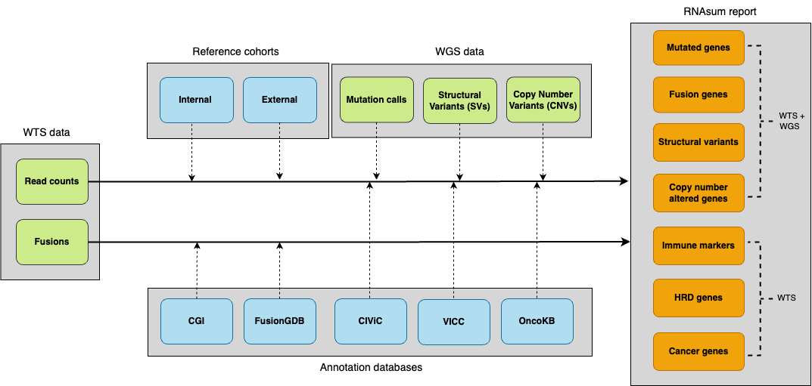

```{r setup, include=FALSE}
knitr::opts_chunk$set(echo = TRUE, eval = FALSE)
```

# RNAsum

Transforms RNA-sequencing data into actionable clinical insights with automated reports.

[](https://doi.org/10.5281/zenodo.17353511)
[](https://opensource.org/licenses/MIT)

**Documentation** | [umccr.github.io/RNAsum](https://umccr.github.io/RNAsum/)

## What is RNAsum?

`RNAsum` is an R package that integrates whole-genome sequencing (WGS) and whole-transcriptome sequencing (WTS) data to generate comprehensive, interactive HTML reports for cancer patient samples.

## Quick start

RNAsum can be installed using one of the following two methods.

### Installation

#### Option 1: from GitHub

`RNAsum` depends on `pdftools`, which requires system-level libraries (poppler, cairo, etc.) to be installed before installing the R package.

---

<details><summary><strong>System dependencies installation</strong></summary>

**Ubuntu/Debian:**

```bash
sudo apt-get install libpoppler-cpp-dev libharfbuzz-dev libfribidi-dev \
                     libfreetype6-dev libcairo2-dev libpango1.0-dev
```

**macOS:**

```bash
brew install poppler
```

**HPC/Cluster (without root):**

If you do not have root access (e.g., on a cluster), creating a fresh Conda environment is the most reliable way to provide necessary system libraries:

```bash
conda create -n rnasum_env -c conda-forge -c bioconda \
  r-base=4.1 poppler harfbuzz fribidi freetype pkg-config \
  cairo openssl pango make gxx_linux-64
conda activate rnasum_env
```

</details>

---

Once system dependencies are met, you can install the package directly from GitHub from within R console.

```{r install-github}
# 1. Increase timeout to prevent download failure for RNAsum.data
options(timeout = 600)

# 2. Install via remotes
if (!require("remotes")) install.packages("remotes")
remotes::install_github("umccr/RNAsum")
```

#### Option 2: from Conda

Conda package is available from the Anaconda umccr channel:

```bash
conda create -n rnasum -c umccr -c conda-forge -c bioconda r-rnasum
conda activate rnasum
```

## Workflow

The pipeline consists of five main components.



1. **WTS data collection**: ingests per-gene read counts and gene fusions.
2. **Reference integration**: normalises against [reference cohorts](./inst/articles/reference_cohorts.md).
3. **WGS data integration**: links genomic alterations with expression data.
4. **Knowledge enrichment**: annotates with clinicaly-relevant databases.
5. **Report generation**: prioritises findings and creates interactive visualizations.

[Detailed workflow documentation](https://umccr.github.io/RNAsum/articles/workflow.html)

## Usage

Add `RNAsum` to PATH environment variable.

```bash
rnasum_cli=$(Rscript -e 'cat(system.file("cli", package="RNAsum"))')
ln -sf "$rnasum_cli/rnasum.R" "$rnasum_cli/rnasum"
export PATH="$rnasum_cli:$PATH"
```

```bash
rnasum --version
```

### Common options

| Option | Description | Default |
|--------|-------------|---------|
| `--sample_name` | Sample identifier | Required |
| `--dataset` | TCGA reference cohort | `PANCAN` |
| `--salmon` | Salmon quantification file | - |
| `--kallisto` | Kallisto abundance file | - |
| `--arriba_tsv` | Arriba fusion detection output | - |
| `--pcgr_tiers_tsv` | PCGR variant calls (tier 1-4) | - |
| `--purple_gene_tsv` | PURPLE copy number by gene | - |
| `--filter` | Filter low-expressed genes | `TRUE` |

Run `rnasum --help` to get complete list of options.

**Note**: human reference genome [GRCh38](https://www.ncbi.nlm.nih.gov/assembly/GCF_000001405.39) (Ensembl based annotation version 105) is used for gene annotation by default. GRCh37 is no longer supported.

## Examples

**Test data**: in `/inst/rawdata/test_data` folder of the GitHub repo  
**Runtime**: < 15 minutes (16GB RAM, 1 CPU)  

### Scenario 1: WGS + WTS (recommended)

Comprehensive reporting, in which WGS-based findings are used as a primary source for expression profile prioritisation.

```bash
cd $rnasum_cli

rnasum \
  --sample_name test_sample_WTS \
  --dataset TEST \
  --salmon "$PWD/../rawdata/test_data/dragen/TEST.quant.genes.sf" \
  --arriba_pdf "$PWD/../rawdata/test_data/dragen/arriba/fusions.pdf" \
  --arriba_tsv "$PWD/../rawdata/test_data/dragen/arriba/fusions.tsv"  \
  --dragen_fusions "$PWD/../rawdata/test_data/dragen/test_sample_WTS.fusion_candidates.final"  \
  --pcgr_tiers_tsv "$PWD/../rawdata/test_data/umccrised/test_sample_WGS/small_variants/TEST-somatic.pcgr.snvs_indels.tiers.tsv" \
  --purple_gene_tsv "$PWD/../rawdata/test_data/umccrised/test_sample_WGS/purple/TEST.purple.cnv.gene.tsv" \
  --sv_tsv "$PWD/../rawdata/test_data/umccrised/test_sample_WGS/structural/TEST-manta.tsv" \
  --report_dir "$PWD/../rawdata/test_data/RNAsum" \
  --save_tables FALSE \
  --filter TRUE
```

The HTML report `test_sample_WTS.RNAsum.html` will be created in the `inst/rawdata/test_data/dragen/RNAsum` folder.

### Scenario 2: WTS only

Basic reporting including information about detected gene fusions and expression levels of key genes.

```bash
cd $rnasum_cli

rnasum \
  --sample_name test_sample_WTS \
  --dataset TEST \
  --salmon "$PWD/../rawdata/test_data/dragen/TEST.quant.genes.sf" \
  --arriba_pdf "$PWD/../rawdata/test_data/dragen/arriba/fusions.pdf" \
  --arriba_tsv "$PWD/../rawdata/test_data/dragen/arriba/fusions.tsv"  \
  --report_dir "$PWD/../rawdata/test_data/RNAsum" \
  --save_tables FALSE \
  --filter TRUE
```

The HTML report `test_sample_WTS.RNAsum.html` will be created in the `inst/rawdata/test_data/dragen/RNAsum` folder.

## What's in the report?

`RNAsum` generates an interactive HTML report with the following core sections:

- **Findings summary**: summary of genes listed across various report sections
- **Mutated genes**: expression of genes with somatic mutations (requires WGS)
- **Fusion genes**: detected gene fusions with functional annotations
- **Structural variants**: expression of genes located within structural variants (requires WGS)
- **CN altered genes**: expression in CN-gained/lost regions (requires WGS)
- **Cancer genes**: expression of cancer-associated genes

[View example reports](https://doi.org/10.5281/zenodo.17353511).

## Available reference datasets

`RNAsum` includes 33 TCGA cancer type cohorts for comparative analysis:

| Cancer Type | Dataset Code | Samples |
|-------------|--------------|---------|
| Pan-Cancer | `PANCAN` | 330 |
| Breast Invasive Carcinoma | `BRCA` | 300 |
| Lung Adenocarcinoma | `LUAD` | 300 |
| Pancreatic Adenocarcinoma | `PAAD` | 150 |

See the complete [TCGA projects summary table](./inst/articles/TCGA_projects_summary.md).

## Documentation

| Resource | Link |
|----------|------|
| Full documentation | [umccr.github.io/RNAsum](https://umccr.github.io/RNAsum/) |
| Workflow details | [workflow.md](https://umccr.github.io/RNAsum/articles/workflow.html) |
| Report structure | [report_structure.md](https://umccr.github.io/RNAsum/articles/report_structure.html) |
| TCGA datasets | [TCGA_projects_summary.md](./inst/articles/TCGA_projects_summary.md) |

## Contributing

We welcome contributions! Please see our [Code of Conduct](./CODE_OF_CONDUCT.md) and contribution guidelines.

### Reporting Issues

Found a bug or have a feature request? [Open an issue](https://github.com/umccr/RNAsum/issues/new).

## Citation

If you use `RNAsum` please cite:

> Kanwal S, Marzec J, Diakumis P, Hofmann O, Grimmond S (2024). "RNAsum: An R package to comprehensively post-process, summarise and visualise genomics and transcriptomics data." version 1.1.0, https://umccr.github.io/RNAsum/

A BibTeX entry for LaTeX users is

```
@Unpublished{,
  title = {RNAsum: An R package to comprehensively post-process, summarise and visualise genomics and transcriptomics data},
  author = {Sehrish Kanwal and Jacek Marzec and Peter Diakumis and Oliver Hofmann and Sean Grimmond},
  year = {2024},
  note = {version 1.1.0},
  url = {https://umccr.github.io/RNAsum/},
}
```
