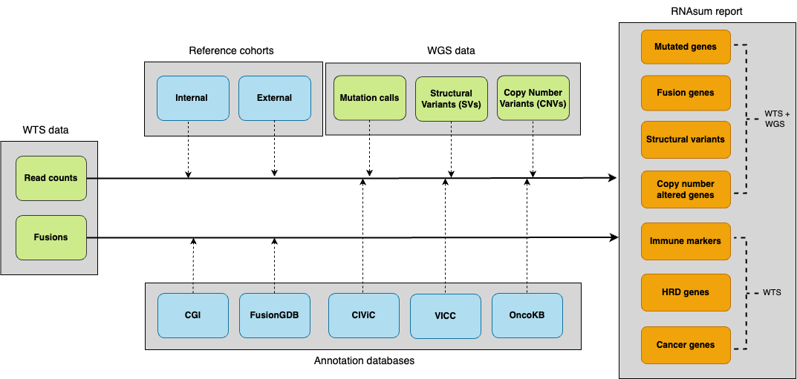

- [RNAsum](#rnasum)
  - [Installation](#installation)
    - [1. System Dependencies
      (Prerequisites)](#1-system-dependencies-prerequisites)
    - [2. Install R Package](#2-install-r-package)
    - [Alternative Installation
      Methods](#alternative-installation-methods)
  - [Example reports](#example-reports)
  - [Workflow](#workflow)
  - [Reference data](#reference-data)
    - [External reference cohorts](#external-reference-cohorts)
    - [Internal reference cohort](#internal-reference-cohort)
  - [Usage](#usage)
    - [Examples](#examples)
    - [Output](#output)

<!-- README.md is generated from README.Rmd. Please edit that file -->

# RNAsum

`RNAsum` is an R package for integrating and interpreting whole-genome
sequencing (WGS) and whole-transcriptome sequencing (WTS) data from
individual cancer patient samples.

**DOCS**: <https://umccr.github.io/RNAsum>

## Installation
RNAsum can be installed using one of the following three methods.

### A. Install from GitHub
- **R** package can be installed directly from the [GitHub
  source](https://github.com/umccr/RNAsum):

#### 1. System Dependencies (Prerequisites)

`RNAsum` depends on `pdftools`, which requires system-level libraries
(poppler, cairo, etc.) to be installed before installing the R package.

**For Linux (Ubuntu/Debian):**

``` bash
sudo apt-get install libpoppler-cpp-dev libharfbuzz-dev libfribidi-dev libfreetype6-dev libcairo2-dev libpango1.0-dev
```

**For macOS:**

``` bash
brew install poppler
```

**For Conda / HPC Environments** If you do not have root access (e.g.,
on a cluster), creating a fresh Conda environment is the most reliable
way to provide necessary system libraries:

``` bash
# Create a dedicated environment with R and system libraries
conda create -n rnasum_env -c conda-forge -c bioconda \
  r-base=4.1 \
  poppler harfbuzz fribidi freetype pkg-config cairo openssl pango make gxx_linux-64

# Activate the environment
conda activate rnasum_env
```

#### 2. Install R Package

Once system dependencies are met, you can install the package directly
from GitHub.

**Note**: The reference data package (RNAsum.data) is large. It is
recommended to increase the download timeout limit before installation.
Launch R:
``` bash
R
```
Then run the following inside the R console:
``` r
# 1. Increase timeout to prevent download failure for RNAsum.data
options(timeout = 600)

# 2. Install via remotes
# (This will automatically resolve CRAN, Bioconductor, and GitHub dependencies)
if (!require("remotes")) install.packages("remotes")

remotes::install_github("umccr/RNAsum") # latest main commit
remotes::install_github("umccr/RNAsum@v0.0.X") # version 0.0.X
remotes::install_github("umccr/RNAsum@abcde") # commit abcde
remotes::install_github("umccr/RNAsum#123") # PR 123
```

### B. Install from Conda

- **Conda** package is available from the Anaconda [umccr
  channel](https://anaconda.org/umccr/r-rnasum):

``` bash
conda create -n rnasum -c umccr -c conda-forge -c bioconda r-rnasum
conda activate rnasum
```
### C. Install from Docker
- **Docker** image is available from the [GitHub Container
  Registy](https://github.com/umccr/RNAsum/pkgs/container/rnasum):

``` bash
docker pull ghcr.io/umccr/rnasum:latest
```

## Example reports

[](https://doi.org/10.5281/zenodo.17353511)

## Workflow

The pipeline consists of five main components illustrated and briefly
described below. For more details, see
[workflow.md](./inst/articles/workflow.md).



1.  Collect patient **WTS data** including per-gene read counts and gene
    fusions.
2.  Add expression data from **[reference cohorts](#reference-data)** to
    get an idea about the expression levels of genes of interest in
    other cancer patient cohorts. The read counts are normalised,
    transformed and converted into a scale that allows to present the
    patient’s expression measurements in the context of the reference
    cohorts.
3.  Supply **genome-based findings** from whole-genome sequencing (WGS)
    data to focus on genes of interest and to provide additional
    evidence for dysregulation of mutated genes, or genes located within
    detected structural variants (SVs) or copy-number (CN) altered
    regions. `RNAsum` is designed to be compatible with WGS patient
    outputs generated from `umccrise`.
4.  Collate results with knowledge derived from in-house resources and
    public databases to provide additional sources of evidence for
    clinical significance of altered genes e.g. to flag variants with
    clinical significance or potential druggable targets.
5.  The final product is an interactive HTML report with searchable
    tables and plots presenting expression levels of the genes of
    interest. The report consists of several sections described
    [here](./inst/articles/report_structure.md).

## Reference data

The reference expression data are available for **33 cancer types** and
were derived from [external](#external-reference-cohorts)
([TCGA](https://tcga-data.nci.nih.gov/)) and
[internal](#internal-reference-cohort)
([CCGCM](https://genomic-cancer-medicine.unimelb.edu.au/research/clinical-cancer-genomics))
resources.

### External reference cohorts

In order to explore expression changes in the patient, we have built a
high-quality external cancer reference cohort.

Depending on the tissue from which the patient’s sample was taken, one
of **33 cancer datasets** from TCGA can be used as a reference cohort
for comparing expression changes in genes of interest of the patient.
Additionally, 10 samples from each of the 33 TCGA datasets were combined
to create the **[Pan-Cancer
dataset](./inst/articles/TCGA_projects_summary.md#pan-cancer-dataset)**,
and for some cohorts **[extended
sets](./inst/articles/TCGA_projects_summary.md#extended-datasets)** are
also available. All available datasets are listed in the **[TCGA
projects summary table](./inst/articles/TCGA_projects_summary.md)**.
These datasets have been processed using methods described in the
[TCGA-data-harmonization](https://github.com/umccr/TCGA-data-harmonization/blob/master/expression/README.md#gdc-counts-data)
repository. The dataset of interest can be specified by using one of the
TCGA project IDs for the `RNAsum` `--dataset` argument (see
[Examples](#examples)).

### Internal reference cohort

The publicly available TCGA datasets are expected to demonstrate
prominent [batch effects](https://www.ncbi.nlm.nih.gov/pubmed/20838408)
when compared to the in-house WTS data due to differences in applied
experimental procedures and analytical pipelines. Moreover, TCGA data
may include samples from tissue material of lower quality and
cellularity compared to samples processed using local protocols. To
address these issues, we have built a high-quality internal reference
cohort processed using the same pipelines as input data (see [data
pre-processing](./inst/articles/workflow.md#data-processing)).

This internal reference set of **40 pancreatic cancer samples** is based
on WTS data generated at
**[CCGCM](https://genomic-cancer-medicine.unimelb.edu.au/research/clinical-cancer-genomics)**
and processed with the **in-house RNA-seq** pipeline to minimise
potential batch effects between investigated samples and the reference
cohort and to make sure the data are comparable. The internal reference
cohort assembly is summarised in the
[Pancreatic-data-harmonization](https://github.com/umccr/Pancreatic-data-harmonization/tree/master/expression/in-house)
repository.

## Usage

``` bash
rnasum_cli=$(Rscript -e 'cat(system.file("cli", package="RNAsum"))')
ln -sf "$rnasum_cli/rnasum.R" "$rnasum_cli/rnasum"
export PATH="$rnasum_cli:$PATH"
```

    $ rnasum --version
    2.0.0 

    $ rnasum --help

<details>

<summary>

<strong>Options</strong>
</summary>

<pre><code>
&#10;--arriba_dir: Directory path to Arriba results containing fusions.pdf and fusions.tsv
&#10;--arriba_pdf: File path of Arriba PDF output
&#10;--arriba_tsv: File path of Arriba TSV output
&#10;--batch_rm: Remove batch-associated effects between datasets
&#10;--cn_gain: CN threshold value to classify genes within gained regions [def: 95]
&#10;--cn_loss: CN threshold value to classify genes within lost regions [def: 5]
&#10;--dataset: Dataset to be used as external reference cohort [def: PANCAN]
&#10;--dataset_name_incl: Include dataset in report name
&#10;--dragen_fusions: File path to DRAGEN RNA-seq 'fusion_candidates.final' output
&#10;--dragen_mapping_metrics: File path to DRAGEN RNA-seq 'mapping_metrics.csv' output
&#10;--dragen_wts_dir: Directory path to DRAGEN RNA-seq results
&#10;--drugs: Include drug matching section in report
&#10;--filter: Filter out low expressed genes
&#10;--immunogram: Include immunogram in report
&#10;--log: Log2 transform data before normalisation
&#10;--norm: Normalisation method
&#10;--pcgr_splice_vars: Include non-coding splice region variants reported in PCGR
&#10;--pcgr_tier: Tier threshold for reporting variants reported in PCGR [def: 4]
&#10;--pcgr_tiers_tsv: File path to PCGR 'snvs_indels.tiers.tsv' output
&#10;--project: Project name, used for annotation purposes only
&#10;--purple_gene_tsv: File path to PURPLE 'purple.cnv.gene.tsv' output
&#10;--report_dir: Directory path to output report
&#10;--salmon: File path to salmon 'quant.genes.sf' output
&#10;--kallisto: File path to kallisto 'abundance.tsv' output
&#10;--sample_name: Sample name to be presented in report
&#10;--sample_source: Type of investigated sample [def: -]
&#10;--save_tables: Save interactive summary tables as HTML
&#10;--scaling: Scaling for z-score transformation (gene-wise or group-wise) [def: gene-wise]
&#10;--subject_id: Subject ID
&#10;--sv_tsv: File path to text file with genes related to structural variation
&#10;--top_genes: Number of top ranked genes to be presented in report
&#10;--transform: Transformation method to be used when converting read counts [def: CPM]
&#10;--umccrise: Directory path of the corresponding WGS-related umccrise data
&#10;--version, -v: Print RNAsum version and exit
&#10;--help, -h: Show this help message and exit
</code></pre>

</details>

**Note**

Human reference genome
***[GRCh38](https://www.ncbi.nlm.nih.gov/assembly/GCF_000001405.39)***
(*Ensembl* based annotation version ***105***) is used for gene
annotation by default. GRCh37 is no longer supported.

### Examples

Below are `RNAsum` CLI commands for generating HTML reports under
different data availability scenarios:

1.  [WTS and WGS data](#1-wts-and-wgs-data)
2.  [WTS data only](#2-wts-data-only)

**Note**

- Example data is provided in the `/inst/rawdata/test_data` folder of
  the GitHub \[repo\]\[rnasum-gh\].
- The `RNAsum` runtime should be less than **15 minutes** using **16GB
  RAM** memory and **1 CPU**.

#### 1. WTS and WGS data

This is the **most frequent and preferred case**, in which the
[WGS](#wgs)-based findings will be used as a primary source for
expression profile prioritisation. The genome-based results can be
incorporated into the report by specifying the location of the
corresponding output files (e.g. results from `PCGR`, `PURPLE`, and
`Manta`). The **`Mutated genes`**, **`Structural variants`** and
**`CN altered genes`** report sections will contain information about
expression levels of the mutated genes, genes located within detected
SVs and CN altered regions, respectively. The results in the
**`Fusion genes`** section will be ordered based on the evidence from
genome-based data. A subset of the TCGA pancreatic adenocarcinoma
dataset is used as reference cohort (`--dataset TEST`).

``` bash
cd $rnasum_cli

rnasum \
  --sample_name test_sample_WTS \
  --dataset TEST \
  --salmon "$PWD/../rawdata/test_data/dragen/TEST.quant.genes.sf" \
  --arriba_pdf "$PWD/../rawdata/test_data/dragen/arriba/fusions.pdf" \
  --arriba_tsv "$PWD/../rawdata/test_data/dragen/arriba/fusions.tsv"  \
  --dragen_fusions "$PWD/../rawdata/test_data/dragen/test_sample_WTS.fusion_candidates.final"  \
  --pcgr_tiers_tsv "$PWD/../rawdata/test_data/umccrised/test_sample_WGS/small_variants/TEST-somatic.pcgr.snvs_indels.tiers.tsv" \
  --purple_gene_tsv "$PWD/../rawdata/test_data/umccrised/test_sample_WGS/purple/TEST.purple.cnv.gene.tsv" \
  --sv_tsv "$PWD/../rawdata/test_data/umccrised/test_sample_WGS/structural/TEST-manta.tsv" \
  --report_dir "$PWD/../rawdata/test_data/RNAsum" \
  --save_tables FALSE \
  --filter TRUE
```

The HTML report `test_sample_WTS.RNAsum.html` will be created in the
`inst/rawdata/test_data/dragen/RNAsum` folder.

#### 2. WTS data only

In this scenario, only [WTS](#wts) data will be used and only expression
levels of key
**[`Cancer genes`](./inst/articles/workflow.md#key-cancer-genes)**,
**`Fusion genes`**, **`Immune markers`** and homologous recombination
deficiency genes (**`HRD genes`**) will be reported. Moreover, gene
fusions reported in the `Fusion genes` report section will not contain
information about evidence from genome-based data. A subset of the TCGA
pancreatic adenocarcinoma dataset is used as the reference cohort
(`--dataset TEST`).

``` bash
cd $rnasum_cli

rnasum \
  --sample_name test_sample_WTS \
  --dataset TEST \
  --salmon "$PWD/../rawdata/test_data/dragen/TEST.quant.genes.sf" \
  --arriba_pdf "$PWD/../rawdata/test_data/dragen/arriba/fusions.pdf" \
  --arriba_tsv "$PWD/../rawdata/test_data/dragen/arriba/fusions.tsv"  \
  --report_dir "$PWD/../rawdata/test_data/RNAsum" \
  --save_tables FALSE \
  --filter TRUE
```

The output HTML report `test_sample_WTS.RNAsum.html` will be created in
the `inst/rawdata/test_data/dragen/RNAsum` folder.

### Output

The pipeline generates a HTML ***Patient Transcriptome Summary***
**[report](#report)** and a [results](#results) folder:

``` text
|
|____<output>
  |____<SampleName>.<output>.html
  |____results
    |____exprTables
    |____glanceExprPlots
    |____...
```

#### Report

The generated HTML report includes searchable tables and interactive
plots presenting expression levels of altered genes, as well as links to
public resources describing the genes of interest.

Detailed description of the report structure, including result
prioritisation and visualisation is available
[here](./inst/articles/report_structure.md).

#### Results

The `results` folder contains intermediate files, including plots and
tables that are presented in the HTML report.

#### Code of Conduct

The code of conduct can be accessed [here](./CODE_OF_CONDUCT.md).

#### Citation

To cite package ‘RNAsum’ in publications use:

> Kanwal S, Marzec J, Diakumis P, Hofmann O, Grimmond S (2024). “RNAsum:
> An R package to comprehensively post-process, summarise and visualise
> genomics and transcriptomics data.” version 1.1.0,
> <https://umccr.github.io/RNAsum/>.

A BibTeX entry for LaTeX users is

      @Unpublished{,
        title = {RNAsum: An R package to comprehensively post-process, summarise and visualise genomics and transcriptomics data},
        author = {Sehrish Kanwal and Jacek Marzec and Peter Diakumis and Oliver Hofmann and Sean Grimmond},
        year = {2024},
        note = {version 1.1.0},
        url = {https://umccr.github.io/RNAsum/},
      }
