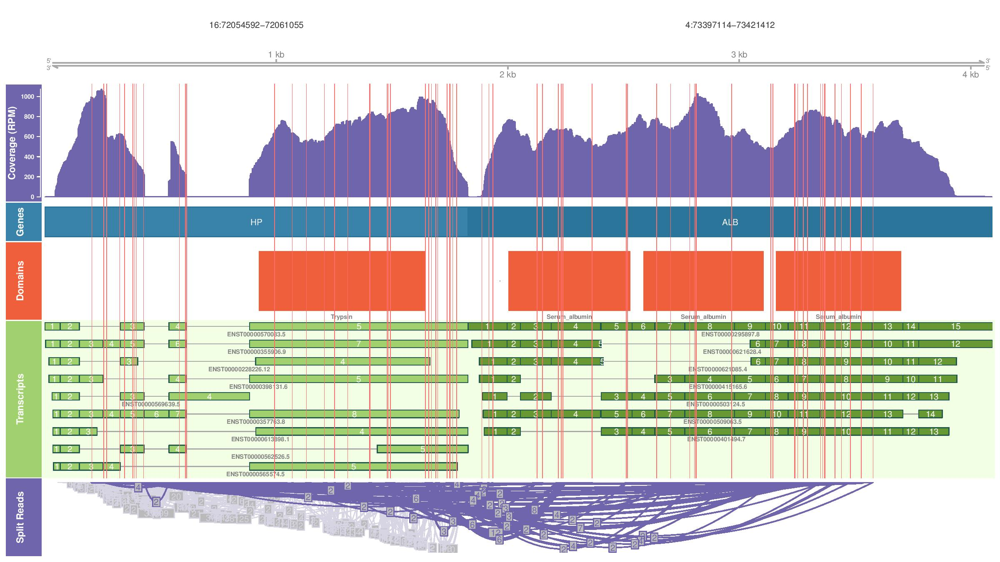

# Introduction

Gene fusions are hybrid genes formed when two previously independent genes become juxtaposed. The fusion can result from structural rearrangements like translocations and deletions, transcription read-through of neighboring genes, or the trans- and cis-splicing of pre-mRNAs [ref](https://www.ncbi.nlm.nih.gov/pmc/articles/PMC4889949/). 


Many gene fusions are associated with oncogenic properties, and often act as driver mutations in a wide array of cancer types.
We are interested in including fusion information into RNAseq report and validate it against genomic evidence. 

## Some concepts

**Chimeric proteins** are hybrid proteins encoded by a nucleotide sequence spliced together from two or more, complete or partial genes. The translational 3′ terminus of the first gene is deleted, as is the promoter at the 5′ terminus of the second structural gene. This type of fusion protein is typically multifunctional, in which each of the fusion partners adds its own separate function.

The genomic **breakpoints** of fusion genes usually occur in intronic or **intergenic regions**, and rarely disrupt coding sequences. This phenomenon may be partly explained by introns being 35 times longer than exons on average (https://www.ncbi.nlm.nih.gov/pmc/articles/PMC3675181/). Oncogenic selection may also play a role, as fusions that disrupt an exon have a two-in-three chance of creating a **frameshifted protein** (caused by a frameshift mutation -also called a framing error or a reading frame shift- is a genetic mutation caused by indels (insertions or deletions) of a number of nucleotides in a DNA sequence that is not divisible by three OR  that shifts the way the sequence is read) with little effect on cellular function. Conversely, intronic breakpoints often lead to in-frame chimeric proteins because exons tend to terminate at codon boundaries. Despite this bias for intronic breakpoints, isolated cases of exon disrupting breakpoints have been reported.

Last and first exon skipping (i.e. the last exon of a gene lacks a splicing donor site that is required for spliceosome function and the first exon of a gene lacks a splicing acceptor site) can occur in fusion genes when an RNA polymerase does not properly terminate transcription at the end of the gene. 

Last and first exon skipping can also occur with fusion genes that arise from chromosomal rearrangements. In this way a rearrangement can produce a functional fusion protein even though one or both genomic breakpoints localize to intergenic regions.

## Explore Pizzly VS Oncofuse

bcbio-RNAseq pipeline support a couple of tools for fusion calling, [pizzly](https://github.com/pmelsted/pizzly) and [oncofuse](http://www.unav.es/genetica/oncofuse.html). Ideally, in the report, we would like to use output from one of the tools that we are confident in. 

The loaction to sample analysis run to get the oncofuse and pizzly results is `/data/cephfs/punim0010/projects/Kanwal_RNASeq_Patients/MH17T001P013-oncofuse-test`

### Pizzly

Pizzly produces a `tsv` file of the genes with the breakpoints indicated relative to the transcript, e.g. 

```geneA.name geneA.id geneB.name geneB.id paircount splitcount transcripts.list```

For comparison purposes, I sorted pizzly output on the paircount value:

```sort -k5 -n -r MH17T001P013-oncofuse-test-flat-filtered.tsv > MH17T001P013-oncofuse-test-flat-filtered-sorted.tsv```

### Oncofuse

Oncofuse is a post-processing tool that takes fusions called by other programs (such as  STAR) as an input and predict oncogenic potential i.e. the probability of being 'driver' events to fusion sequences.

Oncofuse produces a 36 columns output. For comparison purpose, I have selected the following columns (and copied those to a new life). 

```5_FPG_GENE_NAME 3_FPG_GENE_NAME SPANNING_READS ENCOMPASSING_READS GENOMIC P_VAL_CORR DRIVER_PROB```

* `FPG` stands for fusion pair gene.
* Encompassing mate pairs refer to those in which each read aligns to an independent transcript, thereby encompassing the fusion junction. 
* Spanning mate pairs refer to those in which one sequence read aligns to a gene and its mate spans the fusion junction.

Sorted the oncofuse output on the encompassing reads: 

```sort -k4 -n -r MH17T001P013-oncofuse-edited >MH17T001P013-oncofuse-edited-sorted.tsv```

### Result

Importing both pizzly and oncofuse tsvs as dataframe in R to find common fusion gene pairs betwen both tools. The intersection between both results in quite low (35 pairs). Another point is the final filtered calls produced by pizzly are ~100 and oncofuse is ~500, which is an indication of huge amount of false positive predictions.

Thus, we need to find ways to shrink down the list of candidates from fusion detection tools, thus focusing on a reduced set of highly reliable fusions with a potential driver impact into the disease.

## Exploring fusion prioritization tool 

[FuGePrior](https://www.ncbi.nlm.nih.gov/pmc/articles/PMC5260008/) prioritizes gene fusions from paired-end RNA-Seq data. Specifically, the implemented methodology exploits a set of processing and filtering stages to lower the number of fusions from chimeric transcript discovery tools. 

**Requirements**

It needs union list of chimeric candidates from ChimeraScan, defuse and a third chimeric transcript tool selected by the user. The unique limitation on the choice of this last algorithm is the compatibility of its output with Pegasus tool input format.  

Also, we will need to setup:

* ChimeraScan 
* defuse 
* Pegasus tool
* Oncofuse
* Make sure the third tool of interest produces output in the right format, as expected by Pegasus. 
* Also, for each step, manual pre-processign is required (as indicated by this [guide](https://philae.polito.it/paciello/FuGePrior/blob/master/FuGePriorUserGuide.pdf).

Reading through the guide and the way this tool has been structured, I am not convinced it is worth putting effort in (one for discussion). 


## Pizzly/Oncofuse fusion filtering/prioritization

There was a nice point mentioned in the FuGePrior paper; we can sort and filter the oncofuse output on driver probability values for the fusions and compare the results with pizzly output.

After performing this filtering, the possible fusion candidates in oncofuse output reduced from ~500 to 100. 

I also did some filtering on pair count values supporting gene fusions in pizzly output.

**Points to discuss**

* Doing a semi_join (to find common fusions between both callers return a very small number of final results -> 6)

* I am assuming geneA.name in pizzly is the 5' partner gene in fusion pair and vice versa for the geneB.name.
	* To circumvent this issue, I have also checked for the opposite condition on the second `joint.fusion.calls.2` condition in the R script. That also only returned 7 observations.

* We can try doing a union between both callers? This will give us more fusions for further evaluation but we can try narrow down the number by applying more stringent filtering upstream? 

## To Do's

* Check for the pizzly results for the data Sean points us to ( samples with known/validated fusions, so we know what we are expecting to see.)
* Try validating the pizzly results using kallisto (i.e. see https://github.com/pmelsted/pizzly/issues/9)
* We should also try confFuse (see https://github.com/umccr/fusion_annotation).


## Useful reading resources

* Good fusion ref - https://www.nature.com/articles/srep21597
* a good read - https://escholarship.org/uc/item/63v3493d p30 onwards, very clear.
* Good thread - https://github.com/pmelsted/pizzly/issues/19
* see also https://github.com/rdocking/fusebench/wiki/components_and_similar_projects

## Validating pizzly results using kallisto

The basic idea is to run kallisto to quantify the fusion transcripts and select those which have a decent TPM support.

Translating the last two steps `rule append_index` and `rule requant_kallisto` from the snakefile (https://github.com/pmelsted/pizzly/blob/master/test/Snakefile) on commandline. The intial steps are already part of bcbio-RNAseq workflow. 

* Created a new directory on spartan under `/data/cephfs/punim0010/projects/Kanwal_RNASeq_Patients/pizzly-validation` for this work.

* Create a new index based on the transcriptome and the fusion transcripts identified by `pizzly`
9

 ```cat /data/cephfs/punim0010/projects/Kanwal_RNASeq_Patients/MH17T001P013-oncofuse-test/work/inputs/transcriptome/GRCh37.fa /data/cephfs/punim0010/projects/Kanwal_RNASeq_Patients/MH17T001P013-oncofuse-test/final/MH17T001P013-oncofuse-test/pizzly/MH17T001P013-oncofuse-test.fusions.fasta | gzip - > transcripts_with_fusions_fasta.gz```

 ```/data/cephfs/punim0010/local/development/bcbio/galaxy/../anaconda/bin/kallisto index -k 31 -i ./transcripts_with_fusions.kidx transcripts_with_fusions_fasta.gz```
 
* Run `kallisto` in normal quantification mode on the expanded index to quantify both normal transcripts and fusions.
 
 ```/data/cephfs/punim0010/local/development/bcbio/galaxy/../anaconda/bin/kallisto quant -i ./transcripts_with_fusions.kidx -o ./quant_pizzly_post /data/cephfs/punim0010/data/FASTQ/180518_A00130_0058_AH5CN3DSXX/CCR170012_MH17T001P013_S39_R1_001.fastq.gz /data/cephfs/punim0010/data/FASTQ/180518_A00130_0058_AH5CN3DSXX/CCR170012_MH17T001P013_S39_R2_001.fastq.gz```
 
* The script to filter fusion genes on fusion trancripts TPM values is on github `https://github.com/umccr/RNAseq-Analysis-Report/tree/master/fusions/pizzly-filtering.R`

	* In the test data, pizzly originally produced 103 filtered fusion calls. The second round of filtering reduced the number of fusions to 30.

## confFuse

confFuse assigns a confidence score to  each putative fusion transcript from deFuse output. deFuse - a software package for gene fusion discovery using RNA-Seq data - further depends on BLAT, whose license is $$$ for non-academics etc. 

`https://github.com/bcbio/bcbio-nextgen/issues/527#issuecomment-54805226`

 
## Jaffa

JAFFA [ref](https://genomemedicine.biomedcentral.com/articles/10.1186/s13073-015-0167-x) compares a cancer transcriptome to the reference transcriptome, rather than the genome, where the cancer transcriptome is inferred using long reads directly or by de novo assembling short reads. It is a multi-step pipeline that takes raw RNA-Seq reads and outputs a set of candidate fusion genes along with their cDNA breakpoint sequences. 

**Pipeline summary**

1. RNAseq reads are first filtered to remove intronic and intergenic reads (using bowtie2).
2. Assembly is recommended if the read length is less than 50bp.
3. The resulting tumour sequences are then aligned to the reference transcriptome and those that align to multiple genes are selected. These contigs make up a set of initial candidate fusions.
4. Next, the pipeline counts the number of reads or read pairs that span the breakpoint. 
5. Candidated are then aligned to the human genome to determine genomic coordinates of the breakpoint.
6. Further selection and candidate classifcation is carried out using parameters such as genomic gap size, supporting reads and alignment of breakpoints to exon-exon boundaries.
7. A final list of candidate fusions are reported along with their sequence.


Jaffa installation directory is `/data/cephfs/punim0010/projects/Kanwal_Jaffa/`.

**Pointers**

- JAFFA expects the UCSC version of the genome. Other versions (e.g. Ensembl) aren't compatible with JAFFA's reference files. 
- The install script for the pipeline fails to install a couple of dependencies that have to be then manually provided. 
- Step 3 in the [guide](https://github.com/Oshlack/JAFFA/wiki/HowToSetUpJAFFA) mentions to create a `hg38.fa` file. I received an error when running the pipeline:

```
Running JAFFA version 1.09
Checking for required data files...
CAN'T FIND /data/cephfs/punim0010/projects/Kanwal_Jaffa/results_CCR170012_MH17T001P013_S39/../JAFFA-version-1.09/hg38_
genCode22.fa...
PLEASE DOWNLOAD and/or FIX PATH... STOPPING NOW
```
Now trying to rename the file to `hg38_genCode22.fa` to see if the issue is fixed.

After renaming the above file, now getting the following issue:

```
Running JAFFA version 1.09
Checking for required data files...
/data/cephfs/punim0010/projects/Kanwal_Jaffa/results_CCR170012_MH17T001P013_S39/../JAFFA-version-1.09/hg38_genCode22.fa
CAN'T FIND /data/cephfs/punim0010/projects/Kanwal_Jaffa/results_CCR170012_MH17T001P013_S39/../JAFFA-version-1.09/hg38_genCode22.tab...
PLEASE DOWNLOAD and/or FIX PATH... STOPPING NOW
```

So, it turns out the issue is, I need files in the `JAFFA_REFERENCE_FILES_HG38_GENCODE22.tar.gz` (this tar contains both the above files mentioned in the errors) and also http://hgdownload.soe.ucsc.edu/goldenPath/hg38/bigZips/hg38.chromFa.tar.gz (which is the `.fa` file), that too in the root directory of `JAFFA-version-1.09`.

Now, the pipeline is running, until I get a new error :)

- Getting 

`In file(file, "rt") : cannot open file '1000': No such file or directory
Execution halted` 

while running the following command:

```
time /data/cephfs/punim0010/local/development/bcbio/anaconda/bin/Rscript --vanilla --args CCR170012/CCR170012.psl CCR170012/CCR170012.txt 1000 /data/cephfs/punim0010/projects/Kanwal_Jaffa/results_CCR170012_MH17T001P013_S39/../JAFFA-version-1.09/hg38_genCode22.tab < /data/cephfs/punim0010/projects/Kanwal_Jaffa/results_CCR170012_MH17T001P013_S39/../JAFFA-version-1.09/process_transcriptome_blat_table.R &> /data/cephfs/punim0010/projects/Kanwal_Jaffa/results_CCR170012_MH17T001P013_S39/CCR170012/log_filter
```
		- The issue was in the path to R in `tools.groovy` script as R != Rscript
		
- After, updating path to R, it is producing the following error: 

`Error in library(IRanges) : there is no package called 'IRanges'`

and even exporting/specifying `.libPaths()` did not solve the issue.

- Now, trying the JAFFA's conda package (https://bioconda.github.io/recipes/jaffa/README.html)

		- The conda install  `~/.miniconda3/envs/jaffa/share/jaffa-1.09-1` is missing `tools.groovy` that documents the path to tools used by the pipleine.
		
		- Also, needed to craete symlinks to reference file (see `~/.miniconda3/envs/jaffa/share/jaffa-1.09-1`. 
		
		- After specifying all the paths, seems the IRanges issue is no longer produced but now get `cannot open file 'null/hg38_genCode22.tab': No such file or directory`. 

		Not sure, why is there a `null` before the `tab` file in the command:
		
		time ~/.miniconda3/envs/jaffa/bin/R --vanilla --args CCR170012/CCR170012.psl CCR170012/CCR170012.txt 1000 null/hg38_genCode22.tab < /home/sehrishk/.miniconda3/envs/jaffa/share/jaffa-1.09-1/process_transcriptome_blat_table.R &> /data/cephfs/punim0010/projects/Kanwal_Jaffa/results_CCR170012_MH17T001P013_S39/CCR170012/log_filter
		
- As atleast using conda package's R solved the issue with IRanges, next trying to use my initial pipeline setup (not the conda one) but edited its `tools.groovy` to point to conda's R. Now, the step `filter_transcripts` is running.

- The pipeline ran successfully and the results are in `/data/cephfs/punim0010/projects/Kanwal_Jaffa/results_CCR170012_MH17T001P013_S39`.

## Jaffa VS Pizzly fusion genes comparison

* The script used for the analysis is `https://github.com/umccr/RNAseq-Analysis-Report/blob/master/fusions/jaffa-pizzly.R`.

* Both of these made only 3 joint fusion calls.

* Jaffa uses a `known_fusions.txt` file when calling and filtering fusions -> to check if a fusion called is a recurrent fusion or not. 

## Fusion visualization

**Clinker**

Following the installation instructions at: `https://github.com/Oshlack/Clinker/wiki/1.-Installation`.

The conda environment for clinker can be activated using `conda activate clinkerr`.
The location to github repository for clinker is `/data/cephfs/punim0010/projects/Kanwal_Clinker/Clinker`.

Clinker expects input in a specific format:

`chrom1,base1,chrom2,base2`

However, the header of pizzly output looks like this:

```
geneA.name      geneA.id        geneB.name      geneB.id        paircount       splitcount      transcripts.list
VIM     ENSG00000026025 ALB     ENSG00000163631 4       4       ENST00000544301_0:1642_ENST00000509063_0:1911;ENST00000224237_0:1374_ENST00000509063_0:1911;ENST00000487938_0:1374_ENST00000509063_0:1911
```

To extract genomic cordinates for fusion gene pair, this [script](https://github.com/umccr/RNAseq-Analysis-Report/blob/master/fusions/grolar-tsv.R) can be used. 

Looks like, clinker uses all ensemble transcripts, most of which could be non-coding or hypothetical. Need to figure out ways to restrict it to use TSL1 transcripts only.   

**TO DO**

Can the split read component be cleaned up by removing read support of intragenic events? Or just retaining 2-3 fusion arcs with the strongest support?

Ongoing discussion at `https://github.com/Oshlack/Clinker/issues/6`. Currently testing the new `tsl` parameter and removed `Biomart` dependency.

**Update**

Transcript support level [TSL](https://asia.ensembl.org/info/genome/genebuild/transcript_quality_tags.html) has been incorporated into the clinker pipeline. I have been testing it rigorously and it looks stable now (Analysis directory: `/data/cephfs/punim0010/projects/Kanwal/Kanwal_Clinker/update4/Clinker/MH17T001P013/`).

Also, the dependence on BioMart database for querying transcripts has been removed. This is great in a way that now the pipeline could run without running into any issues on worker nodes. 

Before update:



After update:


Few useful parameters to document here are:

- `support` flag allows to specify the minimum read support wanted for splice junctions/fusion junctions. Any junction that has a read support of less than this number will not be represented.

- `ratio` flag is a bit tricky, but essentially it is supposed to be the relative size of each track. For instance, if the track order was axis, coverage, gene track, domain track, transcript track, sashimi plot, its value could be specified as `ratio=1,3,1,2,1,6`.
Need to play a little with this parameter to be able to decide on a value that makes the plot look nicer.


 

