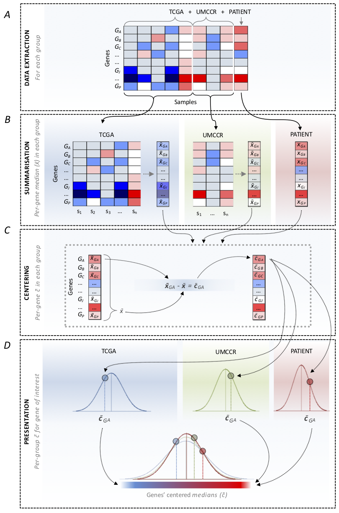

The `RNAsum` workflow is comprised of five main steps shown below.

## 1. Data collection

Read counts data from the patient are collected from the [DRAGEN RNA][dragen] or
[bcbio-nextgen RNA-seq][bcbio] pipeline.

[bcbio]: <https://bcbio-nextgen.readthedocs.io/en/latest/contents/bulk_rnaseq.html>
[dragen]: <https://sapac.illumina.com/products/by-type/informatics-products/basespace-sequence-hub/apps/edico-genome-inc-dragen-rna-pipeline.html>

## 2. Data processing

### Counts processing

The **read count** data (e.g. [abundance.tsv](/inst/rawdata/test_data/final/test_sample_WTS/kallisto/abundance.tsv)
or [quant.sf](/inst/rawdata/test_data/dragen/TEST.quant.sf) quantification
files from [kallisto](https://pachterlab.github.io/kallisto/about) or
[salmon](https://salmon.readthedocs.io/en/latest/salmon.html), respectively)
are processed according to the steps illustrated and described below.

**Figure 1**

Counts processing scheme.

#### Data collection - Fig1A

- Load read count files from the following three sets of data:
  1. patient **sample**
  2. **external reference** cohort
  3. UMCCR **internal reference** set of in-house pancreatic cancer samples

#### Transformation - Fig1B

- Subset datasets to include common genes
- Combine patient **sample** and **internal reference** dataset
- Convert counts to **[CPM](https://haroldpimentel.wordpress.com/2014/05/08/what-the-fpkm-a-review-rna-seq-expression-units/)**
  (*Counts Per Million*; default) or **[TPM](https://haroldpimentel.wordpress.com/2014/05/08/what-the-fpkm-a-review-rna-seq-expression-units/)**
  (*Transcripts Per Kilobase Million*) values in:
  1. **sample** + **internal reference** set
  2. **external reference** set

#### Filtering (optional) - Fig1C

* Filter out genes with low counts (CPM or TPM **< 1** in more than 90% of samples) in:
  1. **sample** + **internal reference** set
  2. **external reference** set

#### Normalisation (optional) - Fig1D

* Normalise data for sample-specific effects in:
  1. **sample** + **internal reference** set
  2. **external reference** set

#### Combination - Fig1E

* Subset datasets to include common genes
* Combine **sample** + **internal reference** set with **external reference** set

#### Batch-effects correction (optional) - Fig1F

* Consider the patient **sample** + **internal reference**
  (regardless of the patient sample origin) as one batch (both sets processed
  with the same pipeline) and corresponding **TCGA dataset** as another batch.
  The objective is to remove data variation due to technical factors.

#### Data scaling

The processed count data is scaled to facilitate interpretation of the expression
values. The data is either scaled:
- **[gene-wise](#gene-wise-z-scoreztransformation)** (Z-score transformation,
default) or
- **[group-wise](#group-wise-centering)** (centering).

##### Gene-wise

Z-scores are comparable by measuring the observations in multiples of the
standard deviation of the given sample. The gene-wise Z-score transformation
procedure is illustrated and described below.

**Figure 2**

Gene-wise Z-score transformation scheme.

* Extract expression values across all samples for a given **gene** (**Fig2A**)
* Compute **Z-scores** for individual samples (see equation in **Fig2B**)
* Compute **median Z-scores** (**Fig2C**) for:
  1. **internal reference** set\*
  2. **external reference** set

* Present patient sample **Z-score** in the context of the reference cohorts'
  **median Z-scores** (**Fig2D**).

\* used only for pancreatic cancer patients

##### Group-wise

The group-wise centering apporach is illustrated and described below.

**Figure 3**

Group-wise centering scheme.

* Extract expression values (**Fig3A**) for:
  1. patient **sample**
  2. **internal reference** set\*
  3. **external reference** set

* For each gene compute **median expression** value (**Fig3B**) in:
  1. **internal reference** set\*
  2.  **external reference** set

* **Center** the median expression values for each gene in individual groups
  (**Fig3C**).
* Present patient sample **centered** expression values in the context the
  reference cohorts' **centered** values (**Fig3D**).

\* used only for pancreatic cancer patients

## 3. Integration with WGS-based results

For patients with available WGS data processed using the
[umccrise](https://github.com/umccr/umccrise) pipeline, the expression level
information for mutated genes or genes located within detected SVs/CNVs, as
well as the genome-based findings, are incorporated and used as primary source
for expression profile prioritisation.

### Somatic SNVs and small indels

* Check if the [PCGR](https://github.com/sigven/pcgr) tiered TSV output file
  is available (e.g. </inst/rawdata/test_data/umccrised/test_sample_WGS/small_variants/pcgr.snvs_indels.tiers.tsv>).
* **Extract** expression level information and genome-based findings for
  genes with detected genomic variants (use `--pcgr_tier` argument to define
  tier threshold value).
* **Order genes** by increasing variant tier and then by decreasing absolute
  values representing difference between expression levels in the patient
  sample and the corresponding reference cohort.

### Structural variants

* Check if the [Manta][manta] annotated TSV output file is available
  (e.g. [example input][manta-ex]).
* **Extract** expression level information and genome-based findings for genes
  located within detected SVs
* **Order genes** by increasing [SV score][sv-score] and then by decreasing
  absolute values representing difference between expression levels in the
  patient sample and the corresponding reference cohort.
* **Compare** gene fusions detected in WTS data ([arriba][arriba] and
  [pizzly][pizzly]) and WGS data ([Manta][manta])
* **Prioritise** WGS-supported gene fusions.

[arriba]: <https://arriba.readthedocs.io/en/latest>
[pizzly]: <https://github.com/pmelsted/pizzly>
[manta]: <https://github.com/Illumina/manta>
[manta-ex]: </inst/rawdata/test_data/umccrised/test_sample_WGS/structural/sv-prioritize-manta.tsv>
[sv-score]: <https://github.com/vladsaveliev/simple_sv_annotation>

### Somatic CNVs

* Check if the [PURPLE][purple] output file is available (e.g.
  [example input][purple-ex]).
* **Extract** expression level **information** and genome-based findings for genes
  located within detected CNVs (use `--cn_loss` and `--cn_gain` arguments to
  define CN threshold values to classify genes within lost and gained regions).
* **Order genes** by increasing (for genes within lost regions) or decreasing
  (for genes within gained regions) Copy Number and then by decreasing
  absolute values representing difference between expression levels in the
  patient sample and the corresponding reference cohort.

[purple]: <https://github.com/hartwigmedical/hmftools/tree/master/purple>
[purple-ex]: </inst/rawdata/test_data/umccrised/test_sample_WGS/purple/purple.gene.cnv>

## 4. Results annotation

WTS- and/or WGS-based results for the altered genes are collated with
knowledge derived from in-house resources and public databases (listed below),
to provide additional sources of evidence for their significance, e.g. to flag
variants with clinical significance or potential druggable targets.

### Key cancer genes

The UMCCR [cancer gene panel][cancer-genes] builds off from several sources:

* [Cancermine](http://bionlp.bcgsc.ca/cancermine/) with at least 2
  publications with at least 3 citations
* [NCG known cancer genes](http://ncg.kcl.ac.uk/)
* Tier 1 [COSMIC Cancer Gene Census](https://cancer.sanger.ac.uk/census) (CGC)
* [CACAO](https://github.com/sigven/cacao) hotspot genes (curated from
  [ClinVar](https://www.ncbi.nlm.nih.gov/clinvar/),
  [CiViC](https://civicdb.org/), and
  [Cancer Hotspots](https://www.cancerhotspots.org/))
* At least 2 matches in the following 5 sources and 8 clinical panels:
  * Cancer predisposition genes ([CPSR](https://github.com/sigven/cpsr) list)
  * [COSMIC Cancer Gene Census](https://cancer.sanger.ac.uk/census) (tier 2)
  * AstraZeneca 300 (AZ300)
  * Familial Cancer
  * [OncoKB](https://oncokb.org/) annotated
  * MSKC-IMPACT
  * MSKC-Heme
  * PMCC-CCP
  * Illumina-TS500
  * TEMPUS
  * Foundation One
  * Foundation Heme
  * Vogelstein

* Used for extracting expression levels of cancer genes (presented in the
  `Cancer genes` report section)
* Used to prioritise candidate fusion genes

[cancer-genes]: <https://github.com/vladsaveliev/NGS_Utils/blob/ac9c9a06031c6c9396a44f2edeec29a2aad4c57d/ngs_utils/reference_data/key_genes/make_umccr_cancer_genes.Rmd>

### OncoKB

* [OncoKB](https://oncokb.org/cancerGenes) gene list is used to annotate
  altered genes across various sections in the report (annotations and URL
  links in `External resources` column in report `Summary tables`).

### VICC

* [Variant Interpretation for Cancer Consortium](https://cancervariants.org/)
  (VICC) knowledgebase is used to annotate altered genes across various
  sections in the report (annotations and URL links in `External resources`
  column in report `Summary tables`).

### CIViC

* The [Clinical Interpretation of Variants in Cancer](https://civicdb.org/)
  (CIViC) database is used to annotate altered genes across various sections in
  the report (annotations and URL links in `External resources` column in
  report `Summary tables`).
* Used to flag clinically actionable aberrations in the `Drug matching` report
  section.

### CGI

* The [Cancer Genome Interpreter](https://www.cancergenomeinterpreter.org/biomarkers)
  (CGI) database is used to flag genes known to be involved in gene fusions and
  to prioritise candidate fusion genes.

### FusionGDB

* [FusionGDB](https://ccsm.uth.edu/FusionGDB/) database is used to flag genes
  known to be involved in gene fusions and to prioritise candidate gene fusions.

### 5. Report generation

The final `RNAsum` HTML ***Patient Transcriptome Summary*** report contains
searchable tables and interactive plots presenting expression levels of altered
genes, as well as links to public resources providing additional source of
evidence for their significance.
