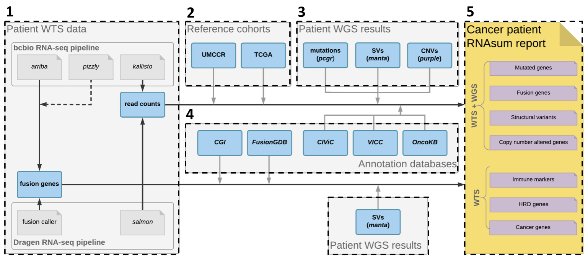
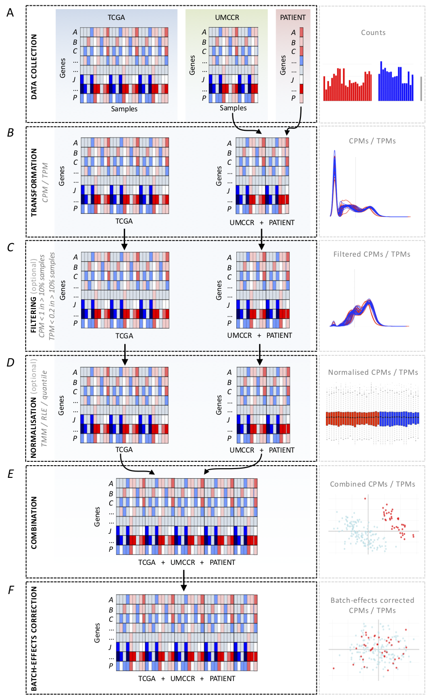
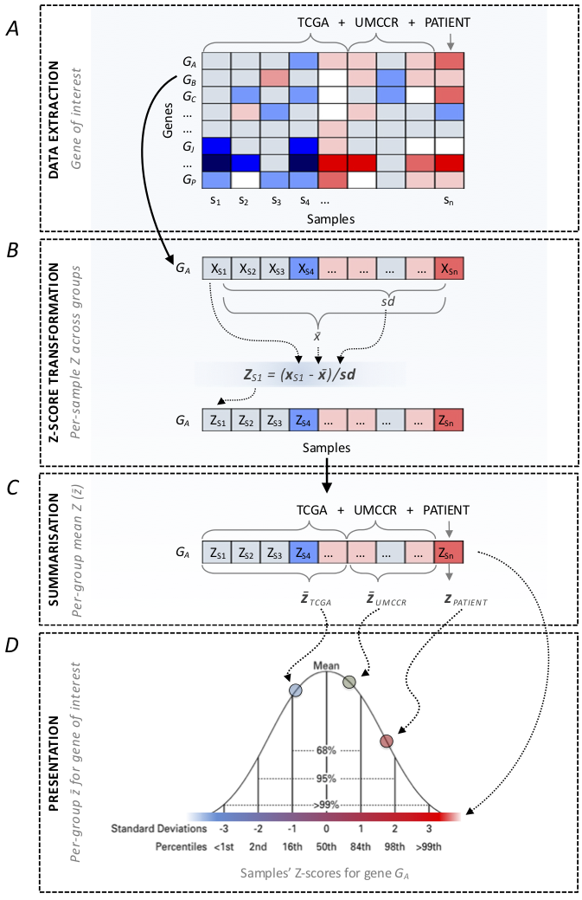
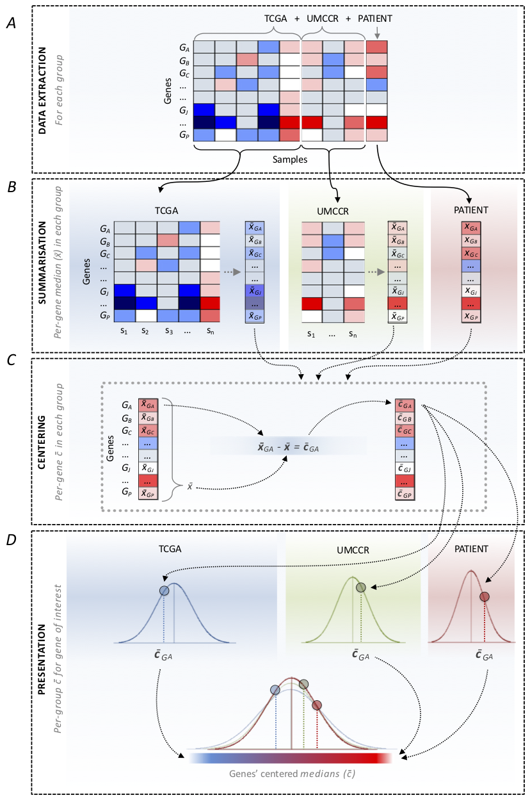

## RNAsum data processing workflow

The description of the main workflow components involved in (**1**) *[read counts](./data/test_data/final/test_sample_WTS/kallisto/abundance.tsv)* and *[gene fusions](./data/test_data/final/test_sample_WTS/arriba/fusions.tsv)* data **[collection](#1-data-collection)**, (**2**) *[read counts](./data/test_data/final/test_sample_WTS/kallisto/abundance.tsv)* data **[processing](#1-data-processing)**, (**3**) **[integration](#2-integration-with-wgs-based-results)** with **[WGS](./README.md#wgs)**-based data (processed using *[umccrise](https://github.com/umccr/umccrise)* pipeline), (**4**) results **[annotation](#3-results-annotation)** and (**5**) presentation in the *Patient Transcriptome Summary* **[report](#4-report-generation)**. 

 

<br/>

## Table of contents

<!-- vim-markdown-toc GFM -->
* [1. Data collection](#1-data-collection)
* [2. Data processing](#2-data-processing)
    * [Counts processing](#counts-processing)
    	* [Data collection](#data-collection)
    	* [Transformation](#transformation)
    	* [Filtering (optional)](#filtering-optional)
    	* [Normalisation (optional)](#normalisation-optional)
    	* [Combination](#combination)
    	* [Batch-effects correction (optional)](#batch-effects-correction-optional)
    	* [Data scaling](#data-scaling)
* [3. Integration with WGS-based results](#3-integration-with-wgs-based-results)
	* [Somatic SNVs and small indels](#somatic-snvs-and-small-indels)
	* [Structural variants](#structural-variants)
	* [Somatic CNVs](#somatic-cnvs)
* [4. Results annotation](#4-results-annotation)
	* [Key cancer genes](#key-cancer-genes)
	* [OncoKB](#oncokb)
	* [VICC](#vicc)
	* [CIViC](#civic)
	* [CGI](#cgi)
	* [FusionGDB](#fusiongdb)
* [5. Report generation](#5-report-generation)

<!-- vim-markdown-toc -->

## 1. Data collection

**[Read counts](./data/test_data/final/test_sample_WTS/kallisto/abundance.tsv)** data from patient sample are collected from *[bcbio-nextgen RNA-seq](https://bcbio-nextgen.readthedocs.io/en/latest/contents/bulk_rnaseq.html)* or *[DRAGEN RNA](https://sapac.illumina.com/products/by-type/informatics-products/basespace-sequence-hub/apps/edico-genome-inc-dragen-rna-pipeline.html)* pipeline.

## 2. Data processing 

### Counts processing

The **read count** data (see [Input data](./README.md#input-data) section in the main page) in *[abundance.tsv](./data/test_data/final/test_sample_WTS/kallisto/abundance.tsv)* or *[quant.sf](./data/test_data/stratus/test_sample_WTS/TEST.quant.sf)* quantification files from [kallisto](https://pachterlab.github.io/kallisto/about) or [salmon](https://salmon.readthedocs.io/en/latest/salmon.html), respectively, are processed following steps illustrated in [Figure 1](./img/counts_post-processing_scheme.png) and described below.

 

###### Figure 1
>Counts processing scheme.

#### Data collection

([Figure 1](./img/counts_post-processing_scheme.png)A)

* Load read count files from the following three sets of data:

	1. patient **sample** (see [Input data](./README.md#input-data) section in the main page)
	2. **external reference** cohort ([TCGA](https://tcga-data.nci.nih.gov/), available cancer types are listed in [TCGA projects summary table](./TCGA_projects_summary.md)) corresponding to the patient cancer sample
	3. UMCCR **internal reference** set of in-house pancreatic cancer samples (regardless of the patient sample origin; see [Input data](./README.md#input-data) section in the main page)

#### Transformation

([Figure 1](./img/counts_post-processing_scheme.png)B)

* Subset datasets to include common genes
* Combine patient **sample** and **internal reference** dataset
* Convert counts to **[CPM](https://haroldpimentel.wordpress.com/2014/05/08/what-the-fpkm-a-review-rna-seq-expression-units/)** (*Counts Per Million*; default) or **[TPM](https://haroldpimentel.wordpress.com/2014/05/08/what-the-fpkm-a-review-rna-seq-expression-units/)** (*Transcripts Per Kilobase Million*) values in:
	1. **sample** + **internal reference** set
	2. **external reference** set

#### Filtering (optional)

([Figure 1](./img/counts_post-processing_scheme.png)C)

* Filter out genes with low counts (CPM or TPM **< 1** in more than 90% of samples) in:
	1. **sample** + **internal reference** set
	2. **external reference** set

#### Normalisation (optional)

([Figure 1](./img/counts_post-processing_scheme.png)D)

* Normalise data (see [Arguments](./README.md#arguments) section in the main page for available options) for sample-specific effects in:
	1. **sample** + **internal reference** set
	2. **external reference** set

#### Combination

([Figure 1](./img/counts_post-processing_scheme.png)E)

* Subset datasets to include common genes
* Combine **sample** + **internal reference** set with **external reference** set

#### Batch-effects correction (optional)

([Figure 1](./img/counts_post-processing_scheme.png)F)

* Consider the patient **sample** + **internal reference** (regardless of the patient sample origin) as one batch (both sets processed with the same pipeline) and corresponding **[TCGA](https://tcga-data.nci.nih.gov/) dataset** as another batch. The objective is to remove data variation due to technical factors.

#### Data scaling

The processed count data is scaled to facilitate expression values interpretation. The data is either scaled **[gene-wise](#gene-wise-z-scoreztransformation)** (Z-score transformation, default) or **[group-wise](#group-wise-centering)** (centering).

##### Gene-wise

Z-scores are comparable by measuring the observations in multiples of the standard deviation of given sample. The gene-wise Z-score transformation procedure is illustrated in [Figure 2](./img/Z-score_transformation_gene_wise.png) and is described below.

 

###### Figure 2
>Gene-wise Z-score transformation scheme.

* Extract expression values across all samples for a given **gene** ([Figure 2](./img/Z-score_transformation_gene_wise.png)A)
* Compute **Z-scores** for individual samples (see equation in ([Figure 2](./img/Z-score_transformation_gene_wise.png)B)
* Compute **median Z-scores** for ([Figure 2](./img/Z-score_transformation_gene_wise.png)C):
	1. **internal reference** set\*
	2.  **external reference** set

* Present patient sample **Z-score** in the context the reference cohorts' **median Z-scores** ([Figure 2](./img/Z-score_transformation_gene_wise.png)D)

\* used only for pancreatic cancer patients

##### Group-wise

The group-wise centering apporach is presented in [Figure 3](./img/centering_group_wise.png) and is described below.


 

###### Figure 3
>Group-wise centering scheme.

* Extract expression values for ([Figure 3](./img/centering_group_wise.png)A):
	1. patient **sample**
	2. **internal reference** set\*
	3.  **external reference** set
	
* For each gene compute **median expression** value in ([Figure 3](./img/centering_group_wise.png)B):
	1. **internal reference** set\*
	2.  **external reference** set
	
* **Center** the median expression values for each gene in individual groups ([Figure 3](./img/centering_group_wise.png)C)
* Present patient sample **centered** expression values in the context the reference cohorts' **centered** values ([Figure 3](./img/centering_group_wise.png)D)

\* used only for pancreatic cancer patients


## 3. Integration with WGS-based results

For patients with available [WGS](./README.md#wgs) data processed using *[umccrise](https://github.com/umccr/umccrise)* pipeline (see ```--umccrise``` [argument](README.md/#arguments)) the expression level information for [mutated](#somatic-snvs-and-small-indels) genes or genes located within detected [structural variants](#structural-variants) (SVs) or [copy-number](#somatic-cnvs) (CN) [altered regions](#somatic-cnvs), as well as the genome-based findings are incorporated and used as primary source for expression profiles prioritisation.

### Somatic SNVs and small indels

* Check if **[PCGR](https://github.com/sigven/pcgr)** output file (see [example](./data/test_data/umccrised/test_sample_WGS/pcgr/test_sample_WGS-somatic.pcgr.snvs_indels.tiers.tsv)) is available
* **Extract** expression level **information** and genome-based findings for genes with detected genomic variants (use ```--pcgr_tier``` [argument](README.md/#arguments) to define [tier](https://pcgr.readthedocs.io/en/latest/tier_systems.html#tier-model-2-pcgr-acmg) threshold value)
* **Ordered genes** by increasing variants **[tier](https://pcgr.readthedocs.io/en/latest/tier_systems.html#tier-model-2-pcgr-acmg)** and then by decreasing absolute values representing difference between expression levels in the patient sample and the corresponding reference cohort

### Structural variants

* Check if **[Manta](https://github.com/Illumina/manta)** output file (see [example](./data/test_data/umccrised/test_sample_WGS/structural/test_sample_WGS-sv-prioritize-manta-pass.tsv)) is available
* **Extract** expression level **information** and genome-based findings for genes located within detected SVs
* **Ordered genes** by increasing **[SV score](https://github.com/vladsaveliev/simple_sv_annotation)** and then by decreasing absolute values representing difference between expression levels in the patient sample and the corresponding reference cohort
* **Compare** [gene fusions](./fusions) detected in [WTS](./README.md#wts) data ([arriba](https://arriba.readthedocs.io/en/latest/) and [pizzly](https://github.com/pmelsted/pizzly)) and [WGS](./README.md#wgs) data ([Manta](https://github.com/Illumina/manta))
* **Priritise** [WGS](./README.md#wgs)-supported [gene fusions](./fusions)

### Somatic CNVs

* Check if **[PURPLE](https://github.com/hartwigmedical/hmftools/blob/master/purple/README.md)** output file (see [example](./data/test_data/umccrised/test_sample_WGS/purple/test_sample_WGS.purple.gene.cnv)) is available
* **Extract** expression level **information** and genome-based findings for genes located within detected CNVs (use ```--cn_loss ``` and ```--cn_gain ``` [arguments](README.md/#arguments) to define CN threshold values to classify genes within lost and gained regions)
* **Ordered genes** by increasing (for genes within lost regions) or decreasing (for genes within gained regions) **[CN](https://github.com/umccr/umccrise/blob/master/workflow.md#somatic-cnv)** and then by decreasing absolute values representing difference between expression levels in the patient sample and the corresponding reference cohort

## 4. Results annotation

[WTS](./README.md#wts)- and/or [WGS](./README.md#wgs)-based results for the altered genes are collated with **knowledge** derived from in-house resources and public **databases** (listed below) to provide additional source of evidence for their significance, e.g. to flag variants with clinical significance or potential druggable targets.

### Key cancer genes

* [UMCCR key cancer genes set](https://github.com/vladsaveliev/NGS_Utils/blob/master/ngs_utils/reference_data/key_genes/make_umccr_cancer_genes.Rmd) build of off several sources:
	* [Cancermine](http://bionlp.bcgsc.ca/cancermine/) with at least 2 publication with at least 3 citations
	* [NCG known cancer genes](http://ncg.kcl.ac.uk/)
	* Tier 1 [COSMIC Cancer Gene Census](https://cancer.sanger.ac.uk/census) (CGC)
	* [CACAO](https://github.com/sigven/cacao) hotspot genes (curated from [ClinVar](https://www.ncbi.nlm.nih.gov/clinvar/), [CiViC](https://civicdb.org/), [Cancer Hotspots](https://www.cancerhotspots.org/))
	* At least 2 matches in the following 5 sources and 8 clinical panels:
		* Cancer predisposition genes ([CPSR](https://github.com/sigven/cpsr) list)
		* [COSMIC Cancer Gene Census](https://cancer.sanger.ac.uk/census) (tier 2)
		* AstraZeneca 300 (AZ300)
		* Familial Cancer
		* [OncoKB](https://oncokb.org/) annotated
		* MSKC-IMPACT
		* MSKC-Heme
		* PMCC-CCP
		* Illumina-TS500
		* TEMPUS
		* Foundation One
		* Foundation Heme
		* Vogelstein

* Used for extracting expression levels of cancer genes (presented in the `Cancer genes` report section)
* Used to prioritise candidate [fusion genes](./fusions)

### OncoKB

* [OncoKB](https://oncokb.org/cancerGenes) gene list is used to annotate altered genes across various sections in the report (annotations and URL links in `External resources` column in report `Summary tables`) 


### VICC

* [Variant Interpretation for Cancer Consortium](https://cancervariants.org/) (VICC) knowledgebase is used to annotate altered genes across various sections in the report (annotations and URL links in `External resources` column in report `Summary tables`) 


### CIViC

* The [Clinical Interpretation of Variants in Cancer](https://civicdb.org/) (CIViC) database is used to annotate altered genes across various sections in the report (annotations and URL links in `External resources` column in report `Summary tables`) 
* Used to flag clinically actionable aberrations in the `Drug matching` report section

### CGI

* The [Cancer Genome Interpreter](https://www.cancergenomeinterpreter.org/biomarkers) (CGI) database is used to flag genes known to be involved in gene fusions and to prioritise candidate [fusion genes](./fusions)
 
### FusionGDB

* [FusionGDB](https://ccsm.uth.edu/FusionGDB/) database is used to flag genes known to be involved in gene fusions and to prioritise candidate [gene fusions](./fusions)

### 5. Report generation

The final html-based ***Patient Transcriptome Summary*** **report** contains searchable tables and interactive plots presenting expression levels of altered genes, as well as links to public resources providing additional source of evidence for their significance. The individual **[report sections](report_structure.md)**, **[results prioritisation](report_structure.md)** and **[visualisation](report_structure.md)** are described more in detail in [report_structure.md](report_structure.md).

